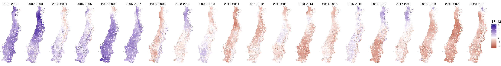
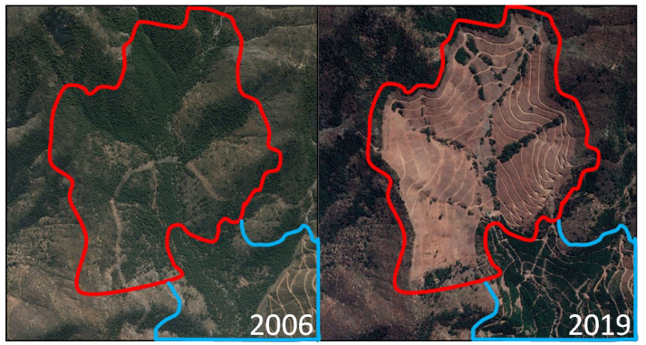
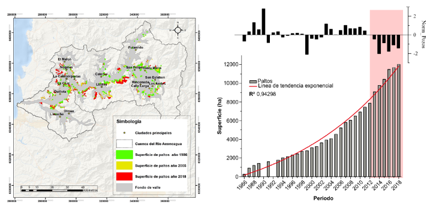
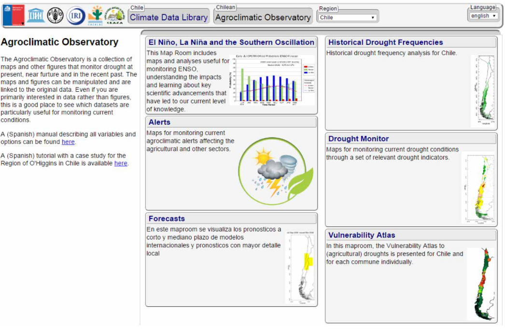
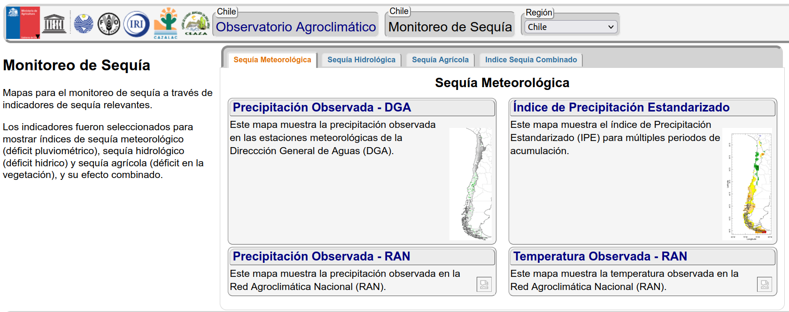
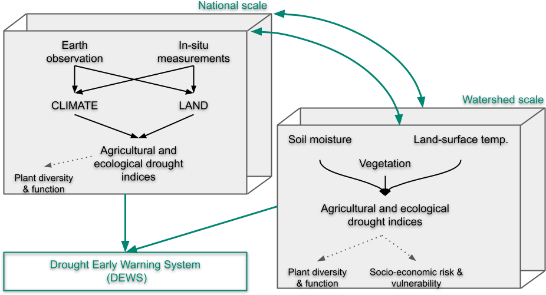

```{r setup, include=FALSE}
options(htmltools.dir.version = FALSE)
knitr::opts_chunk$set(
  fig.width=9, fig.height=3.5, fig.retina=3,
  out.width = "100%",
  cache = FALSE,
  echo = TRUE,
  message = FALSE, 
  warning = FALSE,
  hiline = TRUE
)
```

```{r xaringan-themer, include=FALSE, warning=FALSE}
library(xaringanthemer)
style_duo_accent(
  primary_color = "#1381B0",
  secondary_color = "#FF961C",
  inverse_header_color = "#FFFFFF"
)
```

## Temas a tratar

- Presentación del equipo

- Breve presentación del proyecto

- Hítos y avances: plataforma + visita investigadores extranjeros

- Coordinación 

- Definir nombre plataforma

---
class: inverse, middle, center

# Presentación del equipo

---
## Equipo

### Investigadores Principales

- Dr. Francisco Zambrano (`Director`) [Hemera](http://hemera.umayor.cl) UMayor. Sequía, teledetección y agricultura.
- Dr. Dylan Craven (`Co-Director`). [CEM](https://cem.umayor.cl) UMayor. Ecología
- Dr. Alejandro Venegas. [Hemera](http://hemera.umayor.cl) UMayor. Dendrocronología y Ecología Forestal.
- Dr. Álvaro Gonzales-Reyes. [Hemera](http://hemera.umayor.cl) UMayor. Clima y humedad de suelo.
- Waldo Pérez.  [Hemera](http://hemera.umayor.cl) UMayor. Sistemas de Información Geográfica.

### Investigadores Asociados

- Dr. Francisco Fernández [Escuela de Agronomía](http://umayor.cl) UMayor. Economía Agraría.
- Dr. Freddy Saavedra [Fac. Ciencias Naturales y Exactas](https://www.upla.cl/cienciasnaturalesyexactas/) UPLA. Teledetección - cobertura de nieve.
- Mg. Idania Briceño [Hemera](http://hemera.umayor.cl) UMayor. Teledetección
- Mg. Paulina Vidal [Hemera](http://hemera.umayor.cl) UMayor. Teledetección


---
## Equipo

### Investigadores asociados extranjeros

- Dr. Koen Verbist [IHP-UNESCO](https://en.unesco.org/themes/water-security/hydrology). Implementación de observatorios de sequía.
- Dr. Kirk Karger [WSL](https://www.wsl.ch/en/index.html). Modelación eco-climática.
- Dr. Anton Vrieling [ITC](https://research.utwente.nl/en/persons/anton-vrieling). Monitoreo de la dinámica de la vegetación,

### Profesionales

- Carolina Cordova. Ingeniero Forestal. Coordinación, gestión y difusión.
- Joshua Kunst. Estadístico. Desarrollador plataforma
- Equipo de profesionales UPLA. Teledetección
- Coordinador de terreno. Concurso
- Equipo técnico de apoyo terreno

---
class: inverse, middle, center

# Breve presentación proyecto

---

## Contexto

### Defícit de precipitación en Chile (aka: mega-sequía)


.pull-left[

]
.pull-right[

]
---
## Contexto

### Necesidad

- Proveer de información que permita una mejor toma de decisiones frente a la sequía.

  - Impactos agro-ecológicos
  
  - Impactos socio-económicos
  
  - Avanzar en poder tomar medidas preventivas más que reactivas.
  
---
## Contexto

### Sistemas de alerta temprana de sequía (SATS) 

> Los SATS crean redes de colaboración entre organismos del estado (servicios públicos), organizaciones locales (ej., JdeV) y universidades; para hacer accesible la ciencia en torno a la sequía y útil para la toma de decisiones.

Importancia de los SATS:

- `Permiten la detección temprana de sequía` 
- `Permiten respuestas proactivas (mitigación) y reactivas (emergencia)` 
- `Gatilla acciones` 
- `Provee información para apoyar la toma de decisiones`

---
## Contexto

### Experiencia en Chile con SATS

Junio de 2013 se lanza el Observatorio Agroclimático (https://www.climatedatalibrary.cl)

```{r echo=FALSE,out.width="60%",fig.align='center'}

```

---
## Contexto

### Experiencia en Chile con SATS

```{r echo=FALSE,out.width="60%",fig.align='center'}

```

---
## Propuesta del proyecto

>Desarrollar un Observatorio de Sequía Multi-escala

### Objetivos 

- Monitorear el `clima` y `suelo` en múltiples escalas (nacional y regional)

- Determinar los `impactos` de la sequía sobre sistemas socio-ecológicos 
(escala regional - Valle Aconcagua)

- Desarrollar un sistema de `alerta temprana` de sequía 

---

## Propuesta

```{r echo=FALSE,out.width="80%",fig.align='center'}

```
---
background-image: url("img/fig_map_zcNDVI_EOS_2000-2019.png")
background-position: center
background-size: contain

## Propuesta

### Escala nacional

---
background-image: url("img/anim_dem_aconcagua.gif")
background-position: center
background-size: contain
## Propuesta
### Escala Cuenca del río Aconcagua


---
## Propuesta
### Escala Cuenca del río Aconcagua

```{r, echo=FALSE, out.width="100%",out.height="100%"}
knitr::include_url("html/mapa_aconcagua.html")
```

---
class: inverse, middle, center

# Hítos y avances

---
background-image: url("img/hitos.png")
background-position: center
background-size: contain

---
## Avances

- Prototipo versión 1 de la plataforma

- Visita Dirk Karger (21 - 27 marzo)

- Visita anton Vrieling (29 marzo - 7 abril)

---
class: inverse, middle, center

# Coordinación

---
## Reuniones

- Principio Jeff Bezos

- Reuniones por grupos de acuerdo a hito

- Gestionar a través de Carolina Cordova `(cordova.carolina@gmail.com)` (cc Director y Co-Director)

---
## Difusión

- Tendremos un repositorio en la nube para almacenar todas las fotos atingentes al proyecto.

- Es necesario buscar todas las instancias que permitan hacer difusión del proyecto.

- Cooridnar la difusión a través de Carolina Cordova `(cordova.carolina@gmail.com)`

---
class: inverse, middle, center

# Nombre Plataforma

---
## Opciones

- OBSSA-Chile

- OBSSA

- OBSSAECO

- Propuestas